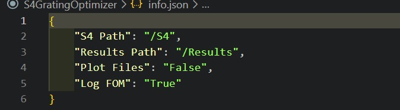
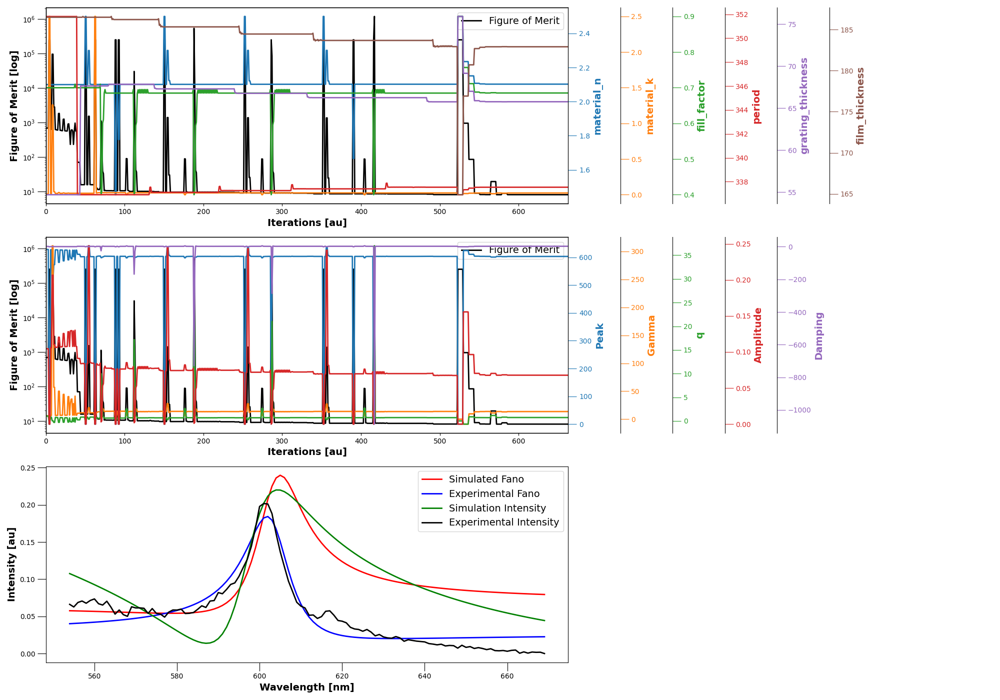

# S4 Grating Optimizer

This software is designed for the analysis of resonant structures using rigorous coupled wave analysis (RCWA). Specifically, the software uses Stanford Stratified Structure Solver (S 4 ), a frequency domain code solving Maxwell's equations in layered periodic structures, to find any key parameter for a periodic structure. The software was designed with 1D resonant gratings in mind but can easily be adapted to include other resonant structures.

More information is available for S 4  [here](https://web.stanford.edu/group/fan/S4/index.html), though some detail of its use can be found later in this document. S 4  is a commonly used tool for RCWA. It is peer-reviewed and open source, lending itself nicely to projects such as this.

This software was created by Josh Male in December 2022 as part of the ongoing analysis of resonant structures. The code is under an MIT License and can be freely used. The development of this software is ongoing, though often sporadic. Check back for updates and feel free to point out mistakes, fork at your own will, and submit commits.

* Note to reader:
  * This document was written by a UK English writer, while it is common for code to be written in US English, this documentation contains a large amount of UK spellings.
  * There are going to be some words that are given in US spelling due to their reference to variables/processes in the code itself.
  * Apologies if this is hard to follow, or if there are any mistakes that have crept through into the documentation.

## Table of Contents

* [General Information](#general-information)
* [Package Requirements](#package-requirements)
* [Launch](#launch)
* [Setup](#setup)
  * [Directory Paths](#directory-paths)
  * [File Names](#file-names)
    * [Film Thickness](#film-thickness)
    * [Grating Thickness](#grating-thickness)
    * [Resonance Position](#resonance-position)
    * [Grating Period](#grating-period)
  * [File Types](#file-types)
  * [Default info.json](#default-info)
* [General Work Flow](#general-work-flow)
  * [Organisation](#organisation)
  * [Data Handling](#data-handling)
  * [Parent Directory](#parent-directory)
  * [Batch Processing](#batch-processing)
  * [Find File Paths](#find-file-paths)
* [Grating Optimizer](#grating-optimizer)
  * [Data Input](#data-input)
  * [Parameter Optimizer](#parameter-optimizer)
    * [Individual Parameter Optimization](#individual-parameter-optimization)
    * [Batch Parameter Optimization](#batch-parameter-optimization)
    * [TM Optimization](#tm-optimization)
  * [Compute Figure Of Merit](#compute-figure-of-merit)
  * [Calculate Figure Of Merit](#calculate-figure-of-merit)
  * [Fano Resonances](#fano-resonances)
  * [Log Figure Merit](#log-figure-of-merit)

[Back to Top](#s4-grating-optimizer)

## General Information

This software is an automatic grating parameter optimizer built using python 3, numpy, scipy, S 4 , lua, and a variety of other python libraries, designed for use with 1D resonant structures. Although adaption is possible, the code was designed around resonant structures that produce a fano-resonance, and care should be applied if moulding for another structure with different resonance behavior.

This read me file should contain all the relevant information required to use the software, make minor adjustments, understand the software enough to have confidence in one's measurements, and possible make alterations to suit your scenario, though it is understood that most people will likely just pull functions suitable for their needs.

Headers for different topics can be found in the contents page, and hopefully all functions are discussed in detail throughout the document.

[Back to Contents](#table-of-contents)

[Back to Top](#s4-grating-optimizer)

## Package Requirements

Language and package requirements can also be found in requirements.txt. The code was built using the following languages and module versions.

* Python 3.6
* tk 0.1.0
* numpy 1.21.4
* matplotlib 3.5.0
* scipy 1.7.2
* lua 5.2.4

[Back to Contents](#table-of-contents)

[Back to Top](#s4-grating-optimizer)

## Launch

The code can be run from any terminal or editor. Main scripts are stored in the repository's main directory, while source code is stored in /src. The code relies on the use of an info.json file for non-windows operating systems, this should be kept in the repository's main directory. Equally, the code relies on an S4_parameters.json file, which should also be stored in the repository's main directory.

[Back to Contents](#table-of-contents)

[Back to Top](#s4-grating-optimizer)

## Setup

Data storage, file naming protocols, directory naming protocols, and other data handling techniques are difficult to compensate for when considering multi-use purposes for software. As such, it is far easier to encourage users to store data under set protocols and leave the software to manipulate expected file names, file paths, directory paths, etc. In this section, I will cover how directory paths, file paths, and naming protocols should be set out for windows and non-windows operating systems.

Keep in mind, the distinction between windows and non-windows operating systems is only present due to the interaction between tkinter's interactive toolkit and the respective operating systems. More will become clear in this section.

[Back to Contents](#table-of-contents)

### Directory Paths

The code relies on the info.json file for non-windows operating systems for data and results directory paths, this is to relieve pressure on users from altering the script or entering their own directory paths, and to ensure user alterations don't break the code. The info.json file should contain relative paths to data and results directories, which must exist. The file should contain the following directory paths:

* {
    "S4 Path": "/relative/path/to/data/files",
    "Results Path": "/relative/path/to/results/directory",
    "Plot Files": "True/False",
    "Log FOM": "True/False"
}

Where the relative paths are relative to the repository's root directory. Windows devices utilise tkinter's interactive path selector and are able to select target files directly, but will require the results path to be present. Default paths are set to:

* {
    "S4 Path": "/S4",
    "Results Path": "/Results",
    "Plot Files": "False",
    "Log FOM": "True"
}

Where the data and results paths are stored within the repository's main directory. The code requires the data files directory to be named S4, i.e., files that are intended for use by the S4 optimizer. No data can be processed if this directory is misnamed as the code uses the directory name to identify key parameters in the file names.

[Back to Contents](#table-of-contents)

### File Names

Handling data and information, as discussed above, is always a challenging aspect of coding. It's far easier to convey specific file information within the file name itself than to have a bank of dictionaries, text files, or equivalent storage format files somewhere with all the relevant information required for data processing. This code is no different, and as such, there are specific pieces of information that are required from the file names that need to be included.

At least 1 measurement file is required for any of the grating parameters for the code to know what the identifier string for the process is, though some modification could lead to a file-less system where the user inputs variables to optimize. The measurement files the code knows how to process are:

* Film thickness files
* Grating thickness files
* Resonance spectrum files
* Grating period files

These files are all .json files and they are each individual results files from the following links:

* [Film Thickness](https://github.com/jm1261/SurfaceProfileAnalysis)
* [Grating Thickness](https://github.com/jm1261/SurfaceProfileAnalysis)
* [Resonance Position](https://github.com/jm1261/PeakFinder)
* [Grating Period](https://github.com/jm1261/MicroscopyPeriodAnalysis)

Where the files require the following file name strings:

* 'Sample Identifier'_Film
* 'Sample Identifier'_Grating
* 'Sample Identifier'_Peak
* 'Sample Identifier'_Period

Respectfully. The code knows how and what to do with these files and more could easily be added going forward. Providing at least 1 of these files is present in the /S4 directory, the code can run. There are checks in place to ensure that there are all the arguments required to run S4 and the code will run without all parameters with no output.

The same identifier string need to be the same for all measured parameters for the same grating or gratings on the same chip. I.e., there can be multiple gratings on one sample identifier, and these should be indicated within the keys of the json files.

Assuming there are multiple gratings on each chip, let's look at what the individual files should look like. For this example, the chip name shall be A1, so all the files should be A1_Film.json, A1_Grating.json, etc. Keep in mind that any multiple grating identifier strings should be consistent over the separate measured parameter files, or the code will not know that the measurements are all for the same grating(s). The exception to this rule is the film thickness file, which I shall cover first.

[Back to Contents](#table-of-contents)

#### Film Thickness

The film thickness file is by far the easiest to organise if you are using the above linked software to process the film thickness files. The film thickness file assumes that, because there could be multiple resonant structures on the same chip, then the film thickness must be the same for all structures on the chip. Therefore, the only keys required in the film thickness file for this software are:

* 'Average Result'
* 'Average Error'

In other words, the film thickness file only need contain a film thickness and an associated error key and value.

* {
    'Average Result': 150,
    'Average Error': 0.1
}

Where values must be given in nm. Film thickness can be given as a constant in the parameter file.

[Back to Contents](#table-of-contents)

#### Grating Thickness

The grating thickness file, which is processed by the same software as the film thickness parameter, requires a list of all gratings on the chip under they key 'AFM Secondary String', and then a series of keys "(grating) Step Height" and "(grating) Step Height Error", where the (grating) is present in the original list of all gratings. For example:

* {
    'AFM Secondary String': [
        'P250',
        'P300',
        'P350'],
    'P250 Step Height': 150,
    'P300 Step Height': 156,
    'P350 Step Height': 156,
    'P250 Step Height Error': 1,
    'P300 Step Height Error': 2,
    'P350 Step Height Error': 3
}

Where, again, the step heights and errors are in nm. Grating thicknesses can be given as a constant in the parameters file.

[Back to Contents](#table-of-contents)

#### Resonance Position

The resonance position file is the single file that is required for the code to run, this file allows the code to cycle through individual gratings on a chip and allows the code to find wavelength ranges, spectrum intensities, resonance peak target position, etc.

The files are so essential that it is recommended to use the following [software](https://github.com/jm1261/PeakFinder) to process experimentally obtained spectrum data and copy the output to the S4 directory here. The software is compatible with a wide range of spectrometers and spectrum capture software and should pose no problem for anyone wanting to use this software.

The README.md file there is easy to follow and guides the user through all attributed of using the software.

[Back to Contents](#table-of-contents)

#### Grating Period

The grating period file, which is processed by the above linked software, but can be manually entered, requires the following pieces of information. The software that processes measured grating periods using SEM analysis, therefore requires a list of the gratings measured under 'SEM Secondary String', and then '(sample name) Average' key, under which the grating key is listed to find the grating period. More information can be found on the above link, but grating periods can be given as a constant in the parameters file.

[Back to Contents](#table-of-contents)

### File Types

All file types for measured parameters are stored in .json dictionary files. This is one of the preferred methods for storing and handling large amounts of data in python and has been used for input data, output data, file paths, and input parameters throughout this code.

[Back to Contents](#table-of-contents)

### Default Info

As discussed in this section, all the user interface is done through the info.json file included in the repository's main directory. This file can be opened using any text editor, and can be adjusted by the user with little-to-no consequence. The default info.json file looks like this:

[Back to Contents](#table-of-contents)

[Back to Top](#s4-grating-optimizer)

## General Work Flow

This section contains general work flow details for the code setup, organisation, data handling, batch processing, and a variety of other general features of the code that could easily be changed to accommodate a user's needs.

### Organisation

The initial section of the code focusses on finding directories and file paths required to process the data. This process is highly dependent on the operating system, due to the relationship between tkinter and non-windows operating systems. The code also makes use of pathlib for file and directory paths to help maintain utility across different operating systems. The root directory is given as the repository's main directory.

Details in the info.json setup file, including directory paths, are pulled in using the function get_directory_paths, which builds the relative paths based on the set root path, which can be changed by adjusting the root variable. The directory paths are then treated as a dictionary, which contains the set directory paths by the user. File paths are returned as an array depending on the operating system. If the operating system is windows, the user can select which files they would like to process. If the operating system is not windows, the user must have all desired files in the set directories as all files in those directories will be processed.

For batch processing, individual gratings on a named chip are pulled into a batch dictionary, and the samples/batches are looped through one-by-one. The parent directory, which for data should be S4 as discussed earlier, is pulled in to determine how to process sample information stored in file names. The parent directory is simply found from the file path using in-built python libraries. All file path and directory path handling functions are stored in filepaths.py, where functions have their own detailed information about what they do, what arguments they require, and what they return.

The code checks to see if the batch has been previously processed by looking for the standard output file name in the designated results path. If this file exists, the batch is skipped to save processing. However, should the file have been moved, renamed, or deleted by the user, then the code will process the batch regardless.

The first step of the analysis is to pull in measured parameters and make sure that all required arguments are present for the designated lua script to run. If there are any missing files, the code breaks the cycle and warns the user which arguments are missing. Ensure that you have set the correct measured and set variables using S4_parameters.json file, and that the required measured variable files are present. The code will not cease in the absence of these files, but no S4 simulations will initiate.

[Back to Contents](#table-of-contents)

### Data Handling

Primary, secondary, and any other identifier strings are pulled from the file name string using sample_information function, which pulls all required parameters for the code from the file name and places them in a dictionary with clear identifier keys. The values of this dictionary are then used throughout the code to pull in required parameters. Therefore, this dictionary is referred to as sample_parameters throughout.

Measured parameters are pulled in using separate sample_information functions depending on the type of measured parameter in question. Secondary keys are only used here to distinguish between measured parameter types so that the code can process the data in the relevant way.

Data files, all .json files, are stored in a batch dictionary and are handled using the primary sample key (sample identifier string). This way, the measured values can always be found for each grating on a sample/chip.

[Back to Contents](#table-of-contents)

### Parent Directory

The parent directory, found by pulling in the directory in which the file is stored, is discussed above in directory paths. The code relies on relevant data being stored in the correctly named directory, allowing the code to distinguish between different data types. The parent directory name should be clear, as discussed above. The parent directory is found using the function get_parent_directory, which returns a string of the parent directory name, which is then used as a parameter identifier key throughout.

[Back to Contents](#table-of-contents)

### Batch Processing

For batch processing, indicated by the batch_ in either the script name or function name, the code then looks for like-file names, typically with the same primary identifier string, and groups them together for processing.

Batches are found using find_S4_batches function, which matches primary identifier strings, groups the file names, file paths, and measured parameter strings and returns a batch dictionary.

Using the batch keys and file paths stored within the batches dictionary, the code begins by pulling file names, file paths, and measured parameter strings into a batch results dictionary and appending each subsequent file parameter into an array under the appropriate key. The parent directory is used from here as a key identifier. The batch results utilises sample_information function in filepaths to pull in this information.

[Back to Contents](#table-of-contents)

### Find File Paths

As discussed above, finding file paths is operating system dependent. On windows operating systems, the code uses tkinter's interactive file selection tool and allows the user to select any of the files in a directory they would like to process. In other operating systems, where tkinter is not native, the code looks for all suitable files within the data directory and will process all of them, unless results have already been obtained and the results file exists.

[Back to Contents](#table-of-contents)

[Back to Top](#s4-grating-optimizer)

## Grating Optimizer

This section contains work flow details to better understand how the grating optimizer is put together and what processes are undertaken in finding the optimum parameters for the periodic structure. It should be said, the code is not perfect and much more work could be put in to guarantee the success of the optimizer 100% of the time. Should the optimizer fail, I suggest a manual approach using S 4 . For the most part, the code is successful and helps to reduce processing time by narrowing in on the optimum parameters.

[Back to Contents](#table-of-contents)

### Data Input

Data is pulled in using the S4_args function in filepaths.py, which reads through the S4_parameters.json file and sets the constants, parameters, and measured parameters as two dictionaries of iteration constants and iteration variables. I.e., this function determines which input parameters are open to optimization, and which should remain constant throughout the process. This function also pulls a list of argument names required to run the designated lua code. If any arguments are missing, the code will break out and return a statement to the user stating which arguments are missing. This is a fail safe as S 4  simulations will run but return 0s if there are any arguments missing.

It should be noted that these constants and variables are exclusively for transverse-electric (TE) polarisation, where transverse-magnetic (TM) polarisation constants and variables are pulled later from the optimized TE parameters. As the TM parameters are pulled from the already optimized TE parameters, there is no need to ensure that all arguments are present, this check has already been done for TE parameters.

[Back to Contents](#table-of-contents)

### Parameter Optimizer

The code utilises input variable parameters to find the optimum grating parameters that match experimentally obtained data. To do this, the code mimics human behavior, starting first by doing a rough sweep of the parameters individually, then narrowing in on a good range before altering all parameters simultaneously.

Due to the nature of guided mode resonances, the code begins looking at the transverse electric (TE) polarisation before moving on to vary only a few parameters for transverse magnetic (TM) polarisation.

A figure of merit is produced to indicate a good fit, though due to the optimize minimize function used here, the figure of merit should be small, nor large. This means a great figure of merit would be between 0 and 1. Figure of merits are always positive due to the squared nature of error calculation discussed later.

[Back to Contents](#table-of-contents)

#### Individual Parameter Optimization

Individual parameter optimization loops through the user-assigned grating variables one at a time to find the best figure of merit for each parameter. The process repeats with each iteration looking for the best figure of merit. Once the full range of iteration variables has finished, the code begins to iterate further, adding to a loop counter.

The loop counter serves two purposes; firstly, to prevent the code looping ad infinitum, with the 6th iteration of all variables serving as the final loop, and secondly it serves as the optimizer tolerance and differential matrix step.

The tolerance and differential step size decreases in size with each loop. This means that as the code loops through the iteration variables, the level of tolerance before the function considers a global minimum becomes smaller, i.e., the search for a global minimum requires more stability with each loop through the variables. As for the step size in the jacobian (differential) matrix, this is simply related to the tolerance for better performance (as recommended by multiple developers).

The precision with which the system can vary the iteration variables is given in the user defined dictionary under the key 'S4 Precision', though there remains some doubt over if this affects the simulation performance.

#### Batch Parameter Optimization

Once the figure of merit reaches >1, or the iteration count reaches 6, the individual variable optimizer considers itself complete. The optimum variables are sent to a dictionary and are fed directly into the batch parameter optimizer. This process is the same, but the system has the ability to vary all parameters simultaneously.

Again, this process returns a figure of merit with respect to experimentally obtained data. The tolerance is reduced further by 1, meaning a higher level of stability required for the batch parameter process. Once the optimizer finds a minimum, values are outputted to a dictionary.

#### TM Optimization

TM optimization piggy-backs on the TE optimizer, using the batch processed variables as a starting guess, but reducing the number of potential variables. As TM resonance occurs in the same physical grating but with a different effective index, the parameters that can be varied are only the refractive index, grating thickness, and film thickness. The same process, with individual and batch variable iterations, is repeated to produce a second figure of merit.

All data is outputted separately into a results file, with a total figure of merit being produced by summing TE and TM figures.

[Back to Contents](#table-of-contents)

### Compute Figure Of Merit

Due to the nature of the optimize module used, the figure of merit for this software is at best when 0. I.e., a smaller figure of merit indicates a better fitting of grating parameters. To manipulate the optimizer into selecting the correct parameters, there are several methods to calculate the figure of merit.

Figure of merit is only calculated once the RCWA simulation is complete, and is a combination of experimental and simulated data, more on this discussed in later subheadings.

The compute figure of merit function in analysis.py requires dictionary variables and constants. Dictionaries are used throughout the code for data handling to ensure variables can be called using "easy-to-read" naming conventions. The dictionaries are created equally for both individual and simultaneous parameter variations to allow the same calculate figure of merit process to be used.

[Back to Contents](#table-of-contents)

### Calculate Figure Of Merit

The figure of merit is calculated using two combined figures of merit. Firstly, the experimental data and the simulated data for resonant intensity is compared directly using an overlap calculation. The intensities are normalized, to between 0 and 1, and the simulated intensity is subtracted from the experimental intensity (and then squared) to create a point-wise difference, with heavier weighting as points begin to drift further away from expected values. This method produces a figure of merit, no greater than the sum of all intensity points (as the difference is never greater than 1).

Then, using a fano resonance fitting method, the experimental and simulated fano parameters are compared. Again, the individual parameters for the simulated data are subtracted from the experimental parameters and squared, to increase the figure of merit exponentially as the fitting becomes poor.

In previous iterations of the code, the fano parameters were weighted, and the combination of the two figures of merit were weighted. However, this is no longer the case due to the relative differences. It was found that, if the scales of the parameters in the fano resonance equation are different, for example resonant wavelength ~100s of nm, and the damping coefficient 0-1, the relative differences between experimental and simulation is sufficient to weight the optimizer without introducing artificial weights. The same applies when combining the two methods, the relative difference between the fano equation parameters is of similar scale to the overlap error. I.e., when one is bad, the other is bad, and as the parameters vary and the optimizer narrows in on the best parameters, the two correlate.

Should no fano resonance be found, the code will return an exceptionally large figure of merit at random between 250,000 and 250,100 (so as not to trick the optimizer into thinking it is complete due to the figure of merit not changing). This number is chosen as an impossibly large figure of merit and ensure the optimizer avoids input grating parameters of that scale.

[Back to Contents](#table-of-contents)

### Fano Resonances

There are two fano resonance equations used in this code, from two competing literature sources. One fano resonance equation is used primarily for experimentally measured fano responses, and as such has a damping coefficient in the equation which can account for scattering loss, and one fano resonance equation without a damping consideration.

In this code, the damping fano resonance equation is treated as the primary equation, where the other is only used if it is impossible to fit the damping coefficient to the simulated data. The reasoning behind this is to ensure that the comparison between simulation and experimental data is as close as possible.

[Back to Contents](#table-of-contents)

### S 4  Simulation

The S 4  simulation requires a corresponding lua script to be in the repository's main directory, though the way this is activated means the command is suitable for any application. The coded ensures that the arguments required to run the S 4  are all present before execution, otherwise the code will fail.

The simulation output is handled by StringIo module, which allows the wavelength, transmission, and reflection data to be handled like a txt file and manipulated by numpy without any printing to the console occurring (which is the usual method).

The constants dictionary generated from the S4_parameters.json, handles the transmission or reflection distinction to keep the code as general as possible. The user simply has to set whether they are working in transmission or reflection.

[Back to Contents](#table-of-contents)

### Log Figure Of Merit

If the user wishes to log the figure of merit, this process is relatively simple. Due to the nature of the optimizer, whereby only one argument can be returned (the figure of merit itself), the logged data has to be outputted to a file during the process.

This logged data includes the input parameters as they vary, the figure of merit value, the current simulation wavelength and intensity (replaced with each iteration), and the fano fit parameters for the optimized grating parameters. These are all stored in separate csv files in the Results directory path and are then plotted to produce a graphical representation. An example of this is shown here:

Here we can see the top image represents the varied grating parameters, their respective values with each iterations and the corresponding figure of merit. The middle graph represents the fano resonance parameters for each peak at each iterations and the corresponding figure of merit produced (same as top graph). The bottom graph is the final simulation and experimental intensity comparison with the best grating parameters.

[Back to Contents](#table-of-contents)

[Back to Top](#s4-grating-optimizer)

## Acknowledgements

Thanks to George, Manuel, Chris, and Sam for their assistance in creating the grating optimizer.
